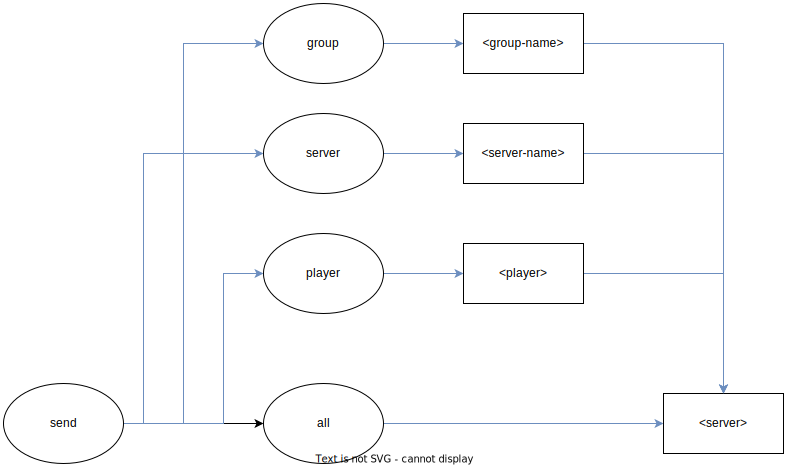

# send 
Plugin to send players to servers on Velocity.

## Commands

### Send:
Permission: `osmc.send.send`

Sending large amounts of players

`/send all factions --delay 100`
Breakdown:
- Send all players
- To the factions server
- Sending a player every 100ms (0.1s)

# Download
Get the latest release <a href="https://github.com/OskarsMC-Plugins/send/releases">here</a>
